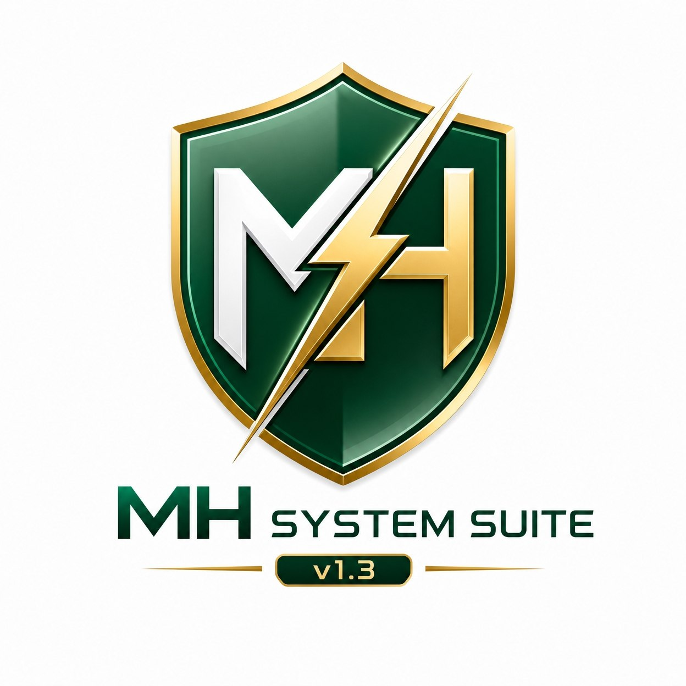
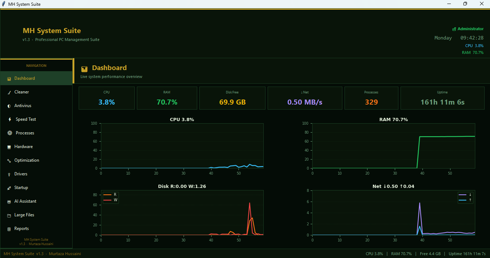
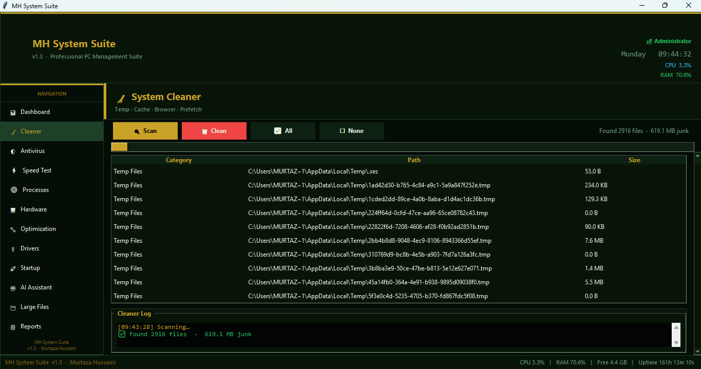
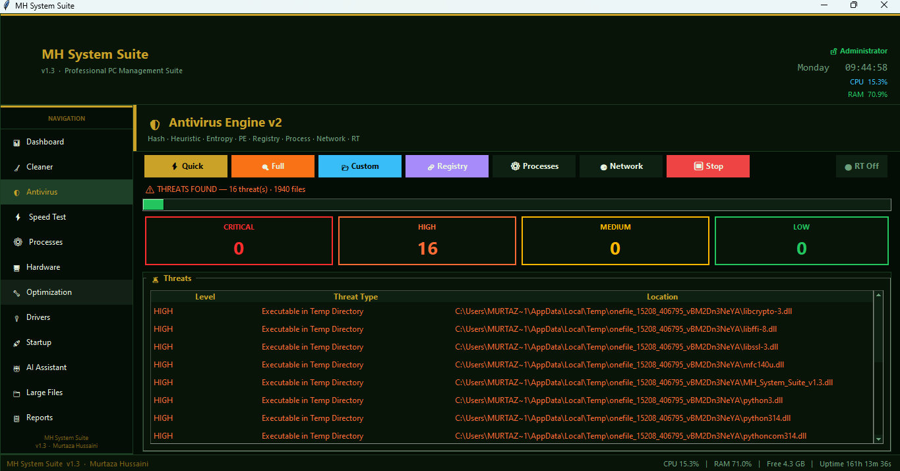
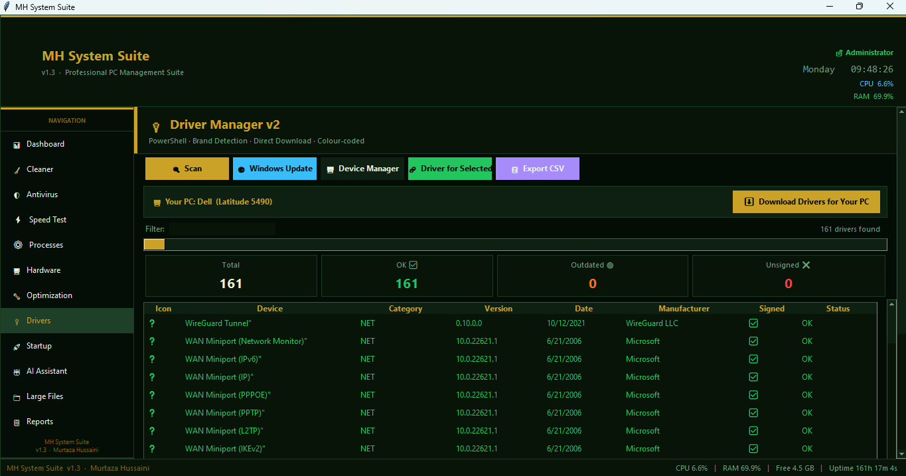

<div align="center">

MH System Toolbox
Professional Windows Maintenance • Optimization • Monitoring • Security Suite


<br/>
> **MH System Toolbox** is an all-in-one Windows utility suite for monitoring, cleaning, optimizing, and securing your PC from a single modern interface.
<br/>
⬇️ Download Installer · ✨ Features · 🚀 Getting Started · 📈 Release History
---
</div>
<br/>
📸 Screenshots
<table>
<tr>
<td width="50%">
Dashboard
<!-- Replace this with your screenshot -->

</td>
<td width="50%">
Cleaner
<!-- Replace this with your screenshot -->

</td>
</tr>
<tr>
<td width="50%">
Antivirus / Security
<!-- Replace this with your screenshot -->

</td>
<td width="50%">
Drivers / Optimization
<!-- Replace this with your screenshot -->

</td>
</tr>
</table>
---
🚀 About The Project
MH System Toolbox is a professional Windows management suite designed to combine system monitoring, cleanup, security scanning, driver support, startup control, performance optimization, and AI-assisted help in one unified application.
The project is built for real-world Windows use: it checks live system stats, helps free disk space, identifies suspicious files and processes, supports driver lookup, and provides tools for gaming/performance tuning and system reporting.
Unlike a single-purpose utility, MH System Toolbox is designed as a complete toolkit for daily PC maintenance and troubleshooting.
---
✨ Features
📊 Monitoring & Dashboard
Live CPU, RAM, disk, and network monitoring
Historical performance charts
Uptime display and status bar metrics
Process count overview
🧹 Cleanup & Storage
Temp file cleaner
Windows cache cleanup
Browser cache cleanup
Prefetch cleanup
Large file scanner
Safe deletion via Recycle Bin when possible
🛡 Security Center
Antivirus Engine v2
SHA256 hash-based detection
Double-extension masking detection
Packed executable detection
Script malware pattern detection
Registry autorun inspection
Suspicious process detection
Suspicious network connection checks
Real-time protection alerts
Quarantine vault
Secure file wiping
⚡ Optimization & Gaming Mode
High-performance power plan switching
System responsiveness tuning
Game DVR / Xbox overlay tweaks
GPU hardware scheduling toggle
RAM clearing
DNS cache flush
Visual effect optimization
Windows Game Mode tuning
🔌 Drivers & Hardware
PC brand detection
Driver Manager v2
Direct manufacturer download links
Windows Update and Device Manager shortcuts
Driver status scanning
Exportable driver reports
🚀 Startup & Processes
Startup manager
Registry Run / RunOnce entries
Startup folder handling
Enable / disable / remove startup items
Process manager tools
🌐 Network & Speed
Live network activity monitor
Ookla / speedtest-cli integration
Download / upload test display
ISP server information
Network status visualization
🤖 AI Assistant
Gemini AI integration
Encrypted key storage when supported
Chat-based help assistant
Conversation clear and copy tools
📋 Reports & Export
System reports generator
Export to JSON
Export to CSV
Export to TXT
Export to HTML
CSV threat report export
---
🧭 What’s New in v1.3
Version 1.3 is the biggest leap in the project so far. It turns MH System Toolbox from a general maintenance tool into a more complete Windows suite with security and productivity upgrades.
Added in v1.3
Antivirus Engine v2
Real-time protection
Quarantine system
Secure delete / secure wipe
Driver Manager v2
PC brand detection
Gaming Mode optimization
Gemini AI Assistant
Large File Finder
System Reports module
Update checker
Better UI and layout organization
Improved in v1.3
Faster and safer scanning workflow
Lazy page loading for better performance
More professional navigation layout
Cleaner logging and status updates
Better exception handling
More structured module architecture
---
📈 Release History
Version 1.1 — Foundation Release
The first release established the core toolbox.
Live dashboard
Cleaner
Speed test
Process monitoring
Basic system tools
Modern GUI foundation
Version 1.2 — Expansion Update
This version focused on expanding usability and system control.
Startup manager
Driver utilities
Reports export
Large file scanner
Optimization tools
UI and performance improvements
Version 1.3 — Security & Professional Edition
This version adds the strongest security and productivity upgrades.
Antivirus Engine v2
Quarantine system
Real-time protection
Heuristic analysis
AI assistant
Gaming mode
Driver Manager v2
Better reports and monitoring
---
🛠 Getting Started
Option 1: Install (Recommended)
Open the latest release page
Download the Windows installer
Run the setup
Launch from the Start Menu or Desktop shortcut
Option 2: Run from Source
```bash
git clone https://github.com/hussaini021/MH-System-Toolbox.git
cd MH-System-Toolbox
pip install -r requirements.txt
python MH_System_Suite_v1.3.py
```
---
📋 System Requirements
Requirement	Minimum	Recommended
OS	Windows 10	Windows 11
RAM	2 GB	4 GB+
Storage	100 MB	200 MB+
Python	3.10	3.12+
Privileges	Administrator recommended	Administrator
---
📦 Dependencies
psutil — system and process monitoring
tkinter — desktop GUI
Pillow — splash screen and image handling
matplotlib — charts and graphs
speedtest-cli — internet speed testing
send2trash — safe file deletion
pywin32 — Windows API / DPAPI support
google-generativeai — Gemini assistant
Install dependencies:
```bash
pip install psutil pillow matplotlib speedtest-cli send2trash pywin32 google-generativeai
```
---
🧱 Project Structure
```text
MH-System-Toolbox/
├── MH_System_Suite_v1.3.py
├── README.md
├── logo.png
├── logo.ico
├── installer.nsi
├── requirements.txt
└── screenshots/
    ├── dashboard.png
    ├── cleaner.png
    ├── antivirus.png
    └── drivers.png
```
---
🔒 Security Notes
MH System Toolbox includes defensive scanning and maintenance features. It is designed to help identify suspicious files, processes, autorun entries, and unusual network activity.
It is not a replacement for a full enterprise antivirus product, but it is a strong local security and inspection tool for Windows maintenance.
---
✅ Why This Project Stands Out
One interface for maintenance, optimization, and security
Real-time monitoring instead of static reports
Practical Windows power-user tools
Heuristic security checks with quarantine support
AI-assisted help for users
Clean installer-friendly distribution
---
🤝 Contributing
Contributions, bug reports, and improvement ideas are welcome.
Fork the repository
Create a feature branch
Commit your changes
Open a Pull Request
---
📜 License
This project is licensed under the MIT License. See the LICENSE file for details.
---
<div align="center">
👨‍💻 Developer
Murtaza Hussaini
Computer Science Student  
Information Systems Engineering — Kabul University
GitHub Profile
<br/>
If this project helps you, consider giving it a ⭐
</div>
